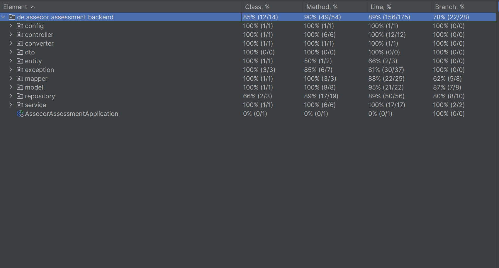

# Assecor Backend Assessment

This project is a RESTful web service for managing person data, built as part of an assessment for Assecor. It fulfills all the core requirements, including reading data from a CSV file and providing a REST API, as well as implementing all bonus features like a secondary database data source (JPA/H2), a POST endpoint for creating new persons, and a robust testing suite.

## Features

- **REST API**: Full CRUD (Create, Read, Delete) functionality for managing person data.
- **Dual Data Sources**: The application supports two persistence layers, selectable via Spring Profiles:
  - **Default (CSV)**: An in-memory repository populated by reading from a `.csv` file at startup.
  - **JPA Profile**: A full persistence layer using Spring Data JPA and an H2 in-memory database. Data is seeded from a `data.sql` file.
- **Profile-Based Configuration**: Clean separation of configuration for different environments/data sources.
- **Comprehensive Testing**: High test coverage with unit, integration, and repository-level tests.
- **CI/CD**: Automated build and test pipeline using GitHub Actions.
- **Centralized Exception Handling**: Provides consistent and meaningful error responses for API clients.

## Technologies Used

- Java 17
- Spring Boot 3
- Spring Data JPA
- Maven
- H2 In-Memory Database
- OpenCSV
- Lombok
- JUnit 5, Mockito, AssertJ

## Getting Started

### Prerequisites

- JDK 17 or later
- Apache Maven 3.6.3 or later

### Building the Project

Clone the repository and build the project using Maven:

```bash
mvn clean install
```

### Running the Application

The application can be run in one of two modes, determined by the active Spring profile.

**1. Default Mode (CSV Data Source)**

This is the default mode. It uses an in-memory repository that reads from `persons.csv`.

```bash
java -jar target/assecor-assessment-backend-0.0.1-SNAPSHOT.jar
```

**2. JPA Mode (H2 Database)**

To run with the H2 in-memory database, activate the `jpa` profile.

```bash
java -jar -Dspring.profiles.active=jpa target/assecor-assessment-backend-0.0.1-SNAPSHOT.jar
```

When running in `jpa` mode, you can access the H2 console at `http://localhost:8080/h2-console` with the following credentials:
- **JDBC URL**: `jdbc:h2:mem:testdb`
- **User Name**: `sa`
- **Password**: (leave blank)

## API Endpoints

The following endpoints are available:

| Method   | Path                  | Description                                      |
|----------|-----------------------|--------------------------------------------------|
| `GET`    | `/persons`            | Retrieves a list of all persons.                 |
| `GET`    | `/persons/{id}`       | Retrieves a single person by their ID.           |
| `GET`    | `/persons/color/{color}` | Retrieves all persons with a specific favorite color. |
| `POST`   | `/persons`            | Creates a new person.                            |
| `DELETE` | `/persons/{id}`       | Deletes a person by their ID.                    |

### Example `POST` Request Body

To create a new person, send a `POST` request to `/persons` with a body like this:

```json
{
  "name": "John",
  "lastname": "Doe",
  "zipcode": "12345",
  "city": "New York",
  "color": "BLUE"
}
```

## Testing

The project has a comprehensive test suite covering the service, controller, and repository layers.

To run the tests, execute the following Maven command:

```bash
mvn test
```

### Test Coverage

A high level of test coverage is maintained, as shown below:



## Continuous Integration

The project is configured with GitHub Actions for continuous integration. The workflow is defined in `.github/workflows/` and automatically triggers on pushes and pull requests to the main branch. It builds the project and runs the full test suite to ensure code quality and stability.
